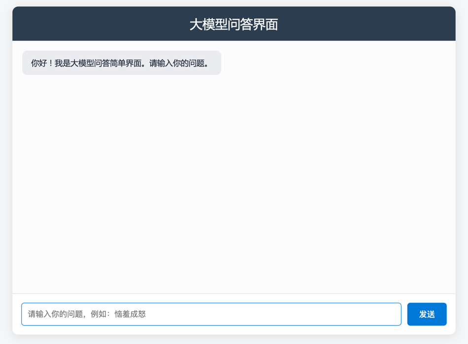
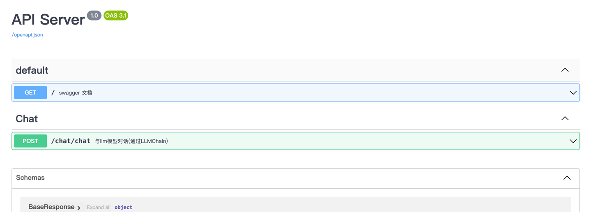

# 1.📘 本地知识库问答系统

# 1.1.📝 项目简介

本项目是一个 轻量级、模块化、可扩展的本地知识库问答系统，结合了 大语言模型（LLM）技术，支持基于自建知识库的智能对话。

系统采用 FastAPI 提供接口，SQLite 作为轻量数据库，结合 LangChain 记忆与回调机制，具备多轮对话、与流式输出等功能。
同时预留了 Gradio/Streamlit WebUI，方便快速构建交互界面。

适合：

	•	学习 AI 应用全流程（数据库设计 → 对话 → 持久化）
	•	快速搭建个人/企业级知识问答助手
	•	教学或科研场景的演示系统

## 1.2.📝 项目价值和意义

### 1. 学术与教学价值

	•	全流程 AI 应用案例：从 大模型对话 → 多轮记忆 → 前端交互，几乎覆盖了 AI 应用开发的所有关键环节，非常适合作为教学案例或科研 Demo。
	•	模块化设计：通过 configs、db、chat、memory 等分层，清晰展示了一个“工业级” AI 应用的架构思路，学习者不仅能学到模型调用，还能学到 工程化最佳实践。


### 2. 工程与应用价值
	•	轻量可落地：基于 SQLite，用户不需要复杂的数据库环境，开箱即用，成本低。
	•	可替换与扩展：支持切换不同大模型（GPT/Qwen/LLaMA 等），方便适配个人、企业或科研团队的不同需求。


### 3. 用户体验价值
	•	对话记忆能力：解决普通对话系统“健忘”的问题，可以进行上下文连贯的多轮问答。
	•	流式输出：模拟 ChatGPT 一样的打字机效果，用户交互体验更自然。
	•	WebUI 扩展：预留了 Gradio/Streamlit 前端，非技术用户也能快速体验。


# 2.🚩 项目解决的问题

	1.	对话缺乏记忆
	•	普通问答无法记住上下文。
	•	本系统支持 ConversationBufferMemory，并将历史持久化到数据库。
	2.	开发/扩展困难
	•	传统系统耦合度高，难以替换模块。
	•	本项目采用模块化架构（检索/记忆/回调/存储分层），扩展性强。
	3.	交互体验不足
	•	传统接口一次性返回，缺乏流式感。
	•	系统支持 SSE 流式输出，提升交互体验。

## 3.1.项目接口和简单页面展示





# 3.📂 项目目录说明
```python
.
├── configs/                       # 配置文件
│   ├── basic_config.py            # 基础配置
│   ├── kb_config.py               # 知识库配置
│   ├── model_config.py            # 模型配置
│   ├── prompt_config.py           # Prompt 模板配置
│   └── server_config.py           # 服务配置
├── sql_data/                      
│   ├── check_sql_data.py          # 数据检查脚本
│   └── info.db                    # SQLite 数据库
├── server/                        # 核心服务代码
│   ├── callback_handler/          # 回调模块
│   │   └── conversation_callback_handler.py
│   ├── chat/                      # 对话逻辑
│   │   ├── chat.py                # 主聊天入口
│   │   └── utils.py               # 对话工具函数
│   ├── db/                        # 数据库管理
│   │   ├── models/                # ORM 模型
│   │   ├── repository/            # Repository 数据访问层
│   │   ├── base.py                # ORM Base 类
│   │   └── session.py             # DB 会话控制
│   ├── sql_data/                  # 数据迁移
│   │   └── migrate.py
│   ├── memory/                    # 对话记忆
│   │   └── conversation_db_buffer_memory.py
│   ├── reranker/                  # Reranker 重排序模块
│   ├── static/                    # 静态文件（预留）
│   ├── api.py                     # API 接口路由
│   └── utils.py                   # 通用工具函数
├── webui_pages/                   # WebUI 页面（Gradio/Streamlit）


```

# 4.⚙️ 技术栈

	•	后端框架：FastAPI
	•	数据库：SQLite + SQLAlchemy ORM
	•	大语言模型：OpenAI GPT / Qwen / 可替换其他 API
	•	会话记忆：LangChain Memory + 自定义 CallbackHandler
	•	接口：REST API + SSE 流式输出
	•	前端：Gradio / Streamlit（可选）


# 5.✨ 功能亮点
	1.	多轮对话记忆：支持 conversation_id，记住上下文并存储。
	2.	流式输出：逐字生成回答，提升体验。
	3.	模块化设计：检索、记忆、回调解耦，方便维护与扩展。
	4.	轻量可移植：基于 SQLite，无需复杂部署即可运行。
	5.	多种交互方式：REST API + WebUI（可扩展）。

# 6.模块详解


## 二、模块详解（逐层解析）

### `configs/`
- **用途**：存放配置文件（如模型名称、API 密钥、向量库参数等）

### `sql_data/`

#### `check_sql_data.py`
- **功能**：检查并打印数据库表结构和数据，用于调试

#### `info.db`
- **功能**：SQLite 数据库文件
- **包含表**：
  - `conversation`：对话元信息（ID、名称、创建时间）
  - `message`：消息记录（query/response/conversation_id）

### `server/` —— 核心服务层

#### `callback_handler/conversation_callback_handler.py`
- **功能**：监听 LLM 输出，自动将 response 写入数据库
- **关键技术**：
  - 继承 `BaseCallbackHandler`
  - `on_llm_end` 事件捕获生成结果
  - 调用 `update_message()` 持久化

#### `chat/chat.py`
- **功能**：主聊天接口，处理用户输入，调用 LLM，返回流式响应
- **关键技术**：
  - FastAPI 接口定义
  - `EventSourceResponse` 实现 SSE 流式输出
  - 使用 `AsyncIteratorCallbackHandler` 支持逐字生成
  - 支持 `conversation_id` 管理多轮对话

#### `chat/utils.py`
- **功能**：辅助函数，如历史消息处理、提示词构造

#### `db/models/`
- **功能**：使用 SQLAlchemy 定义 ORM 模型
  - `conversation_model.py` → `Conversation` 表
  - `message_model.py` → `Message` 表

#### `db/repository/`
- **功能**：数据访问层（DAO），实现 Repository 模式
  - `conversation_repository.py`：增删改查 conversation
  - `message_repository.py`：增删改查 message

####  `db/base.py`
- **功能**：定义 Base 类，用于所有模型继承

####  `db/session.py`
- **功能**：数据库会话管理
  - `session_scope()`：上下文管理器，自动 commit/rollback/close
  - `@with_session`：装饰器，自动注入 session

####  `sql_data/migrate.py`
- **功能**：数据库迁移脚本，用于创建表结构

####  `memory/conversation_db_buffer_memory.py`
- **功能**：基于数据库的对话记忆模块
- **关键技术**：
  - 继承 LangChain 的 `ConversationBufferMemory`
  - 从数据库加载历史消息

####  `static/`
- **用途**：静态资源（CSS/JS/图片），预留

####  `server/api.py`
- **功能**：API 路由入口，聚合所有接口

####  `server/utils.py`
- **功能**：通用工具函数
  - `get_ChatOpenAI()`：获取 LLM 实例
  - `get_prompt_template()`：加载 prompt 模板

####  `webui_pages/`
- **功能**：WebUI 页面（Gradio 或 Streamlit）


# 7.🚀 快速开始
## 7.1. 环境准备

- 需要在configs/model_config.py中配置好大模型的API Key等信息。
- /server/utils.py文件中的API KEY。
- 安装必要的环境依赖即可。运行/server/api.py文件即可。

